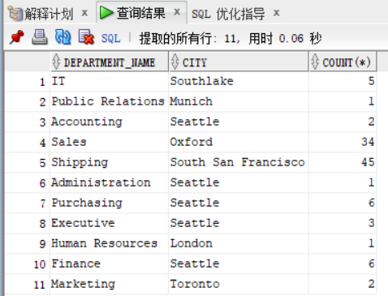
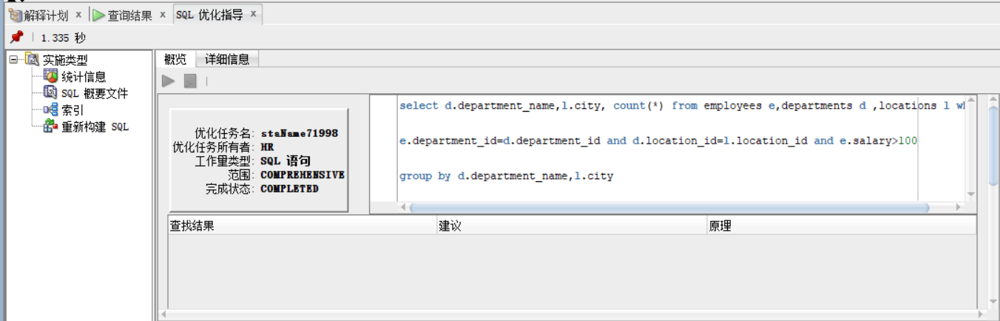

# Oracle实验一自定义查询分析文档
# 自定义查询：
####自定义查询源代码
```
     select d.department_name,l.city, count(*) 
     from employees e,departments d ,locations l 
     where e.department_id=d.department_id 
     and d.location_id=l.location_id and e.salary>100
     group by d.department_name,l.city;
```
####自定义查询结果

####自定义查询指导优化

####自定义查询详细过程
####
```
    GENERAL INFORMATION SECTION
    -------------------------------------------------------------------------------
    Tuning Task Name   : staName71998
    Tuning Task Owner  : HR
    Tuning Task ID     : 445
    Workload Type      : Single SQL Statement
    Execution Count    : 1
    Current Execution  : EXEC_436
    Execution Type     : TUNE SQL
    Scope              : COMPREHENSIVE
    Time Limit(seconds): 1800
    Completion Status  : COMPLETED
    Started at         : 10/18/2018 11:49:48
    Completed at       : 10/18/2018 11:49:48
    
    -------------------------------------------------------------------------------
    Schema Name   : HR
    Container Name: PDBORCL
    SQL ID        : 7vksvpfc98bm3
    SQL Text      : select d.department_name,l.city, count(*) from employees
                    e,departments d ,locations l where
                    e.department_id=d.department_id and
                    d.location_id=l.location_id and e.salary>100
                    group by d.department_name,l.city
    
    -------------------------------------------------------------------------------
    There are no recommendations to improve the statement.
    
    -------------------------------------------------------------------------------
    EXPLAIN PLANS SECTION
    -------------------------------------------------------------------------------
    
    1- Original
    -----------
    Plan hash value: 1469438592
    
     
    ---------------------------------------------------------------------------------------------------
    | Id  | Operation                      | Name             | Rows  | Bytes | Cost (%CPU)| Time     |
    ---------------------------------------------------------------------------------------------------
    |   0 | SELECT STATEMENT               |                  |   106 |  4028 |     9  (23)| 00:00:01 |
    |   1 |  HASH GROUP BY                 |                  |   106 |  4028 |     9  (23)| 00:00:01 |
    |*  2 |   HASH JOIN                    |                  |   106 |  4028 |     8  (13)| 00:00:01 |
    |   3 |    MERGE JOIN                  |                  |   106 |  2756 |     6  (17)| 00:00:01 |
    |   4 |     TABLE ACCESS BY INDEX ROWID| DEPARTMENTS      |    27 |   513 |     2   (0)| 00:00:01 |
    |   5 |      INDEX FULL SCAN           | DEPT_ID_PK       |    27 |       |     1   (0)| 00:00:01 |
    |*  6 |     SORT JOIN                  |                  |   107 |   749 |     4  (25)| 00:00:01 |
    |*  7 |      TABLE ACCESS FULL         | EMPLOYEES        |   107 |   749 |     3   (0)| 00:00:01 |
    |   8 |    VIEW                        | index$_join$_003 |    23 |   276 |     2   (0)| 00:00:01 |
    |*  9 |     HASH JOIN                  |                  |       |       |            |          |
    |  10 |      INDEX FAST FULL SCAN      | LOC_CITY_IX      |    23 |   276 |     1   (0)| 00:00:01 |
    |  11 |      INDEX FAST FULL SCAN      | LOC_ID_PK        |    23 |   276 |     1   (0)| 00:00:01 |
    ---------------------------------------------------------------------------------------------------
     
    Query Block Name / Object Alias (identified by operation id):
    -------------------------------------------------------------
     
       1 - SEL$1       
       4 - SEL$1        / D@SEL$1
       5 - SEL$1        / D@SEL$1
       7 - SEL$1        / E@SEL$1
       8 - SEL$84D1845C / L@SEL$1
       9 - SEL$84D1845C
      10 - SEL$84D1845C / indexjoin$_alias$_001@SEL$84D1845C
      11 - SEL$84D1845C / indexjoin$_alias$_002@SEL$84D1845C
     
    Predicate Information (identified by operation id):
    ---------------------------------------------------
     
       2 - access("D"."LOCATION_ID"="L"."LOCATION_ID")
       6 - access("E"."DEPARTMENT_ID"="D"."DEPARTMENT_ID")
           filter("E"."DEPARTMENT_ID"="D"."DEPARTMENT_ID")
       7 - filter("E"."SALARY">100)
       9 - access(ROWID=ROWID)
     
    Column Projection Information (identified by operation id):
    -----------------------------------------------------------
     
       1 - (#keys=2) "D"."DEPARTMENT_NAME"[VARCHAR2,30], "L"."CITY"[VARCHAR2,30], COUNT(*)[22]
       2 - (#keys=1) "D"."DEPARTMENT_NAME"[VARCHAR2,30], "L"."CITY"[VARCHAR2,30]
       3 - (#keys=0) "D"."LOCATION_ID"[NUMBER,22], "D"."DEPARTMENT_NAME"[VARCHAR2,30]
       4 - "D"."DEPARTMENT_ID"[NUMBER,22], "D"."DEPARTMENT_NAME"[VARCHAR2,30], 
           "D"."LOCATION_ID"[NUMBER,22]
       5 - "D".ROWID[ROWID,10], "D"."DEPARTMENT_ID"[NUMBER,22]
       6 - (#keys=1) "E"."DEPARTMENT_ID"[NUMBER,22]
       7 - "E"."DEPARTMENT_ID"[NUMBER,22]
       8 - "L"."LOCATION_ID"[NUMBER,22], "L"."CITY"[VARCHAR2,30]
       9 - (#keys=1) "L"."CITY"[VARCHAR2,30], "L"."LOCATION_ID"[NUMBER,22]
      10 - ROWID[ROWID,10], "L"."CITY"[VARCHAR2,30]
      11 - ROWID[ROWID,10], "L"."LOCATION_ID"[NUMBER,22]
    
    -------------------------------------------------------------------------------
```
#### 自定义查询结果分析
自定义查询源代码的查询时间是0.06秒，极大程度的优化了查询语句的查询时间。查询1中的cost =9,rows=106,谓词信息中有1次索引搜索access,1次全表搜索filter。自定义查询语句是先汇总后过滤(having子句)，参与汇总与计算的数据偏多。但由于无更好的优化条件，暂无更好的办法。
