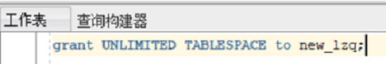

# 实验三实验文档
#### 本实验使用3个表空间：USERS,USERS02,USERS03。在表空间中创建两张表：订单表(orders)与订单详表(order_details)。
#### 使用你自己的账号创建本实验的表，表创建在上述3个分区，自定义分区策略。
* ## 创建orders分区表代码
```
CREATE TABLE orders 
(
 order_id NUMBER(10, 0) NOT NULL 
 , customer_name VARCHAR2(40 BYTE) NOT NULL 
 , customer_tel VARCHAR2(40 BYTE) NOT NULL 
 , order_date DATE NOT NULL 
 , employee_id NUMBER(6, 0) NOT NULL 
 , discount NUMBER(8, 2) DEFAULT 0 
 , trade_receivable NUMBER(8, 2) DEFAULT 0 
，add  primary key (order_id)
) 
TABLESPACE USERS 
PCTFREE 10 INITRANS 1 
STORAGE (   BUFFER_POOL DEFAULT ) 
NOCOMPRESS NOPARALLEL 
PARTITION BY RANGE (order_date) 
(
 PARTITION PARTITION_BEFORE_2016 VALUES LESS THAN (
 TO_DATE(' 2016-01-01 00:00:00', 'SYYYY-MM-DD HH24:MI:SS', 
 'NLS_CALENDAR=GREGORIAN')) 
 NOLOGGING 
 TABLESPACE USERS 
 PCTFREE 10 
 INITRANS 1 
 STORAGE 
( 
 INITIAL 8388608 
 NEXT 1048576 
 MINEXTENTS 1 
 MAXEXTENTS UNLIMITED 
 BUFFER_POOL DEFAULT 
) 
NOCOMPRESS NO INMEMORY  
, PARTITION PARTITION_BEFORE_2017 VALUES LESS THAN (
TO_DATE(' 2017-01-01 00:00:00', 'SYYYY-MM-DD HH24:MI:SS', 
'NLS_CALENDAR=GREGORIAN')) 
NOLOGGING 
TABLESPACE USERS02 
 PCTFREE 10 
 INITRANS 1 
 STORAGE 
( 
 INITIAL 8388608 
 NEXT 1048576 
 MINEXTENTS 1 
 MAXEXTENTS UNLIMITED 
 BUFFER_POOL DEFAULT 
) 
NOCOMPRESS NO INMEMORY
, PARTITION PARTITION_BEFORE_2018 VALUES LESS THAN (
TO_DATE(' 2018-01-01 00:00:00', 'SYYYY-MM-DD HH24:MI:SS', 
'NLS_CALENDAR=GREGORIAN')) 
NOLOGGING 
TABLESPACE USERS03 
 PCTFREE 10 
 INITRANS 1 
 STORAGE 
( 
 INITIAL 8388608 
 NEXT 1048576 
 MINEXTENTS 1 
 MAXEXTENTS UNLIMITED 
 BUFFER_POOL DEFAULT 
) 
NOCOMPRESS NO INMEMORY
);
```
#### 订单order表创建结果如图

* ## 创建order_details分区表代码
```
CREATE TABLE order_details 
(
id NUMBER(10, 0) NOT NULL 
, order_id NUMBER(10, 0) NOT NULL
, product_id VARCHAR2(40 BYTE) NOT NULL 
, product_num NUMBER(8, 2) NOT NULL 
, product_price NUMBER(8, 2) NOT NULL 
, CONSTRAINT order_details_fk1 FOREIGN KEY  (order_id)
REFERENCES orders  (  order_id   )
ENABLE 
) 
TABLESPACE USERS 
PCTFREE 10 INITRANS 1 
STORAGE (   BUFFER_POOL DEFAULT ) 
NOCOMPRESS NOPARALLEL
PARTITION BY REFERENCE (order_details_fk1)
(
PARTITION PARTITION_BEFORE_2017 
NOLOGGING 
TABLESPACE USERS
PCTFREE 10 
 INITRANS 1 
 STORAGE 
( 
 INITIAL 8388608 
 NEXT 1048576 
 MINEXTENTS 1 
 MAXEXTENTS UNLIMITED 
 BUFFER_POOL DEFAULT 
) 
NOCOMPRESS NO INMEMORY
,PARTITION PARTITION_BEFORE_2018
NOLOGGING 
TABLESPACE USERS02
PCTFREE 10 
 INITRANS 1 
 STORAGE 
( 
 INITIAL 8388608 
 NEXT 1048576 
 MINEXTENTS 1 
 MAXEXTENTS UNLIMITED 
 BUFFER_POOL DEFAULT 
) 
NOCOMPRESS NO INMEMORY  
,PARTITION PARTITION_BEFORE_2019
NOLOGGING 
TABLESPACE USERS03
PCTFREE 10 
 INITRANS 1 
 STORAGE 
( 
 INITIAL 8388608 
 NEXT 1048576 
 MINEXTENTS 1 
 MAXEXTENTS UNLIMITED 
 BUFFER_POOL DEFAULT 
) 
NOCOMPRESS NO INMEMORY  
);
```
#### 订单详情表order_details创建结果如图


* ## 你需要使用system用户给你自己的账号分配上述分区的使用权限。你需要使用system用户给你的用户分配可以查询执行计划的权限。
* ## 权限分配截图

#### order_details空间权限分配代码
```
    grant unlimited tablespace to new_lzq;
```
#### order_details空间权限分配成功图片



## 插入数据，数据能并平均分布到各个分区。每个表的数据都应该大于1万行，对表进行联合查询。
* ## 插入对应数据并联合查询
### 插入orders表数据
#### 插入orders表数据代码
```
declare 
  m integer; 

begin 
--输出开始时间 
  dbms_output.put_line('start:'||sysdate); 
  m:=0;
--循环插入的数据量 
  for i in 1..3334 loop 
   m:=m+1; 
insert into ORDERS (ORDER_ID,CUSTOMER_NAME,CUSTOMER_TEL,ORDER_DATE,EMPLOYEE_ID,DISCOUNT,TRADE_RECEIVABLE) 
values (m,'user'||m,'10000',to_date('2016-05-04 00:00:00', 'SYYYY-MM-DD HH24:MI:SS'),001,15,29);
    commit; 
  end loop; 
--输出结束时间 
  dbms_output.put_line('end:'||sysdate); 
end;
```
#### 插入order表数据成功截图


### 插入order_details表数据
#### 插入order_details表数据代码
```
declare 
  m integer; 
begin 

--输出开始时间 
  dbms_output.put_line('start:'||sysdate); 
  m:=0;

--循环插入的数据量 
  for i in 1..3334 loop 
   m:=m+1; 
insert into ORDER_DETAILS (ID,ORDER_ID,PRODUCT_ID,PRODUCT_NUM,PRODUCT_PRICE) 
values (m,m,'product'||m,15,29);
    commit; 
  end loop; 
--输出结束时间 
  dbms_output.put_line('end:'||sysdate); 
end;
```
#### 插入orders表数据成功截图


## 联合查询结果
#### 联合查询代码
```
select 
    orders.order_id as AID,
    orders.customer_name as customer_name,
    order_details.order_id as BID,
    ORDER_DETAILS.PRODUCT_ID as product_id
from
    ORDERS
INNER JOIN ORDER_DETAILS ON (orders.order_id=order_details.order_id);
```
#### 联合查询结果


## 分析语句的执行计划
### 执行计划代码
```
EXPLAIN plan for
select 
    orders.order_id as AID,
    orders.customer_name as customer_name,
    order_details.order_id as BID,
    ORDER_DETAILS.PRODUCT_ID as product_id
from
    ORDERS
INNER JOIN ORDER_DETAILS ON (orders.order_id=order_details.order_id);

select * from table(dbms_xplan.display());
```
### 执行计划结果

### 执行计划结论
#### 由执行结果可知：最先执行的是TABLE ACCESS FULL，意思为对order_details表进行全表扫描。

#### 然后其次执行的是PARTITION REFERENCE ALL，对分区进行引用。

#### 然后对order_id进行索引唯一扫描，因为为order_details的外键。

#### 又因为使用了join，所以又进行了NESTED LOOPS连接查询。

#### 再对orders表进行TABLE ACCESS BY GLOBAL INDEX ROWID，即rowid与索引的扫描，找出符合条件的元素。最后将数据查出。

* ## 分区与不分区的对比结论
#### 范围分区：就是根据数据库表中某一字段的值的范围来划分分区。
#### 范围分区将数据基于范围映射到每一个分区，这个范围是你在创建分区时指定的分区键决定的。这种分区方式是最为常用的，并且分区键经常采用日期。
#### Oracle的表分区功能通过改善可管理性、性能和可用性，从而为各式应用程序带来了极大的好处。没有分配权限普通用户只能创建表，读写会报错，所有创建表用要分配权限。