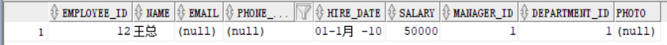
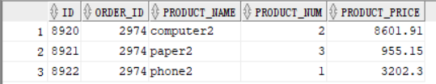
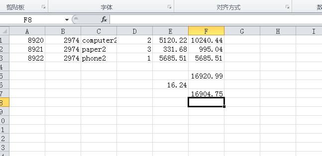
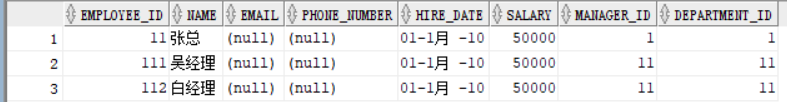
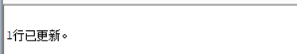
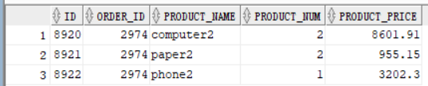
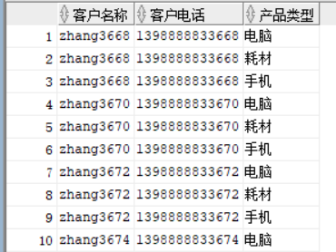
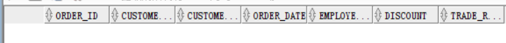
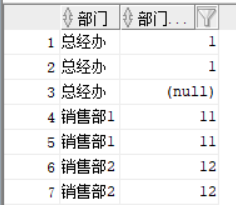

# 实验四实验文档
## 实验四：对象管理
* ### 实验场景：
#### 假设有一个生产某个产品的单位，单位接受网上订单进行产品的销售。通过实验模拟这个单位的部分信息：员工表，部门表，订单表，订单详单表。
* ### 实验内容：
## 录入数据：
要求至少有1万个订单，每个订单至少有4个详单。至少有两个部门，每个部门至少有1个员工，其中只有一个人没有领导，一个领导至少有一个下属，并且它的下属是另一个人的领导（比如A领导B，B领导C）。
#### 列表的应用：
插入ORDERS和ORDER_DETAILS 两个表的数据时，主键ORDERS.ORDER_ID, ORDER_DETAILS.ID的值必须通过序列SEQ_ORDER_ID和SEQ_ORDER_ID取得，不能手工输入一个数字。
#### 触发器的应用：
维护ORDER_DETAILS的数据时（insert,delete,update）要同步更新ORDERS表订单应收货款ORDERS.Trade_Receivable的值。
* ##### 插入相应数据
```
declare
  dt date;
  m number(8,2);
  V_EMPLOYEE_ID NUMBER(6);
  v_order_id number(10);
  v_name varchar2(100);
  v_tel varchar2(100);
  v number(10,2);
begin
  for i in 1..10000
  loop
    if i mod 2 =0 then
      dt:=to_date('2015-3-2','yyyy-mm-dd')+(i mod 60);
    else
      dt:=to_date('2016-3-2','yyyy-mm-dd')+(i mod 60);
    end if;
    V_EMPLOYEE_ID:=CASE I MOD 6 WHEN 0 THEN 11 WHEN 1 THEN 111 WHEN 2 THEN 112
                                WHEN 3 THEN 12 WHEN 4 THEN 121 ELSE 122 END;
    v_order_id:=SEQ_ORDER_ID.nextval;
    v_name := 'aa'|| 'aa';
    v_name := 'zhang' || i;
    v_tel := '139888883' || i;
    insert /*+append*/ into ORDERS (ORDER_ID,CUSTOMER_NAME,CUSTOMER_TEL,ORDER_DATE,EMPLOYEE_ID,DISCOUNT)
      values (v_order_id,v_name,v_tel,dt,V_EMPLOYEE_ID,dbms_random.value(100,0));
    v:=dbms_random.value(10000,4000);
    v_name:='computer'|| (i mod 3 + 1);
    insert /*+append*/ into ORDER_DETAILS(ID,ORDER_ID,PRODUCT_NAME,PRODUCT_NUM,PRODUCT_PRICE)
      values (SEQ_ORDER_DETAILS_ID.NEXTVAL,v_order_id,v_name,2,v);
    v:=dbms_random.value(1000,50);
    v_name:='paper'|| (i mod 3 + 1);
    insert /*+append*/ into ORDER_DETAILS(ID,ORDER_ID,PRODUCT_NAME,PRODUCT_NUM,PRODUCT_PRICE)
      values (SEQ_ORDER_DETAILS_ID.NEXTVAL,v_order_id,v_name,3,v);
    v:=dbms_random.value(9000,2000);
    v_name:='phone'|| (i mod 3 + 1);
    insert /*+append*/ into ORDER_DETAILS(ID,ORDER_ID,PRODUCT_NAME,PRODUCT_NUM,PRODUCT_PRICE)
      values (SEQ_ORDER_DETAILS_ID.NEXTVAL,v_order_id,v_name,1,v);
    select sum(PRODUCT_NUM*PRODUCT_PRICE) into m from ORDER_DETAILS where ORDER_ID=v_order_id;
    if m is null then
     m:=0;
    end if;
    UPDATE ORDERS SET TRADE_RECEIVABLE = m - discount WHERE ORDER_ID=v_order_id;
    IF I MOD 1000 =0 THEN
      commit;
    END IF;
  end loop;
```
* ##### 下面是手工增加的一个表空间USERS02。
```
 Create Tablespace Users02
        datafile
        '/home/oracle/app/oracle/oradata/orcl/pdborcl/pdbtest_users02_1.dbf'
          SIZE 100M AUTOEXTEND ON NEXT 256M MAXSIZE UNLIMITED,
        '/home/oracle/app/oracle/oradata/orcl/pdborcl/pdbtest_users02_2.dbf'
          SIZE 100M AUTOEXTEND ON NEXT 256M MAXSIZE UNLIMITED
        EXTENT MANAGEMENT LOCAL SEGMENT SPACE MANAGEMENT AUTO;
```
* #####  下面是创建用户study
```
             CREATE USER STUDY IDENTIFIED BY 123
             DEFAULT TABLESPACE "USERS"
             TEMPORARY TABLESPACE "TEMP";
             
             -- QUOTAS
             ALTER USER STUDY QUOTA UNLIMITED ON USERS;
             ALTER USER STUDY QUOTA UNLIMITED ON USERS02;
             ALTER USER STUDY ACCOUNT UNLOCK;
             
             -- ROLES
             GRANT "CONNECT" TO STUDY WITH ADMIN OPTION;
             GRANT "RESOURCE" TO STUDY WITH ADMIN OPTION;
             ALTER USER STUDY DEFAULT ROLE "CONNECT","RESOURCE";
             
             -- SYSTEM PRIVILEGES
             GRANT CREATE VIEW TO STUDY WITH ADMIN OPTION;
```
## 查询数据：
1.查询某个员工的信息
```
select * from EMPLOYEES where  EMPLOYEE_ID=12;
select * from order_details where order_id=2974;
```




2.递归查询某个员工及其所有下属，子下属员工。
```
WITH A (EMPLOYEE_ID,NAME,EMAIL,PHONE_NUMBER,HIRE_DATE,SALARY,MANAGER_ID,DEPARTMENT_ID) AS
(SELECT EMPLOYEE_ID,NAME,EMAIL,PHONE_NUMBER,HIRE_DATE,SALARY,MANAGER_ID,DEPARTMENT_ID
FROM EMPLOYEES WHERE employee_ID = 11
UNION ALL
SELECT B.EMPLOYEE_ID,B.NAME,B.EMAIL,B.PHONE_NUMBER,B.HIRE_DATE,B.SALARY,B.MANAGER_ID,B.DEPARTMENT_ID
FROM A, EMPLOYEES B WHERE A.EMPLOYEE_ID = B.MANAGER_ID)
SELECT * FROM A;
```


3.查询订单表，并且包括订单的订单应收货款: Trade_Receivable= sum(订单详单表.ProductNum*订单详单表.ProductPrice)- Discount。
```
select sum(PRODUCT_NUM*PRODUCT_PRICE) into m from ORDER_DETAILS where ORDER_ID=v_order_id;
if m is null then
 m:=0;
end if;
UPDATE ORDERS SET TRADE_RECEIVABLE = m - discount WHERE ORDER_ID=v_order_id;
IF I MOD 1000 =0 THEN
  commit; --每次提交会加快插入数据的速度
END IF;
end loop;
```
##### 更新数据：
```
update order_details set product_num=2 where id=8921;
```



4.查询订单详表，要求显示订单的客户名称和客户电话，产品类型用汉字描述。
```
select CUSTOMER_NAME as "客户名称",CUSTOMER_TEL as "客户电话",PRODUCT_TYPE as "产品类型"
from ORDERS o,PRODUCTS p,ORDER_DETAILS d
where o.ORDER_ID=d.ORDER_ID 
and d.PRODUCT_NAME=p.PRODUCT_NAME;
```


5.查询出所有空订单，即没有订单详单的订单。
```
select distinct         
ORDERS.ORDER_ID,ORDERS.CUSTOMER_NAME,
ORDERS.CUSTOMER_TEL,ORDERS.ORDER_DATE,
ORDERS.EMPLOYEE_ID,ORDERS.DISCOUNT,ORDERS.TRADE_RECEIVABLE 
from ORDERS where ORDERS.ORDER_ID not in (select ORDER_ID from ORDER_DETAILS);
```


6.查询部门表，同时显示部门的负责人姓名。
```
select DEPARTMENT_NAME as "部门",MANAGER_ID as "部门负责人" 
from DEPARTMENTS d,EMPLOYEES e
where d.DEPARTMENT_ID=e.DEPARTMENT_ID;
```


7.查询部门表，统计每个部门的销售总金额。
```
select DEPARTMENT_NAME,SUM(ORDERS.TRADE_RECEIVABLE)AS "销售总金额"
from DEPARTMENTS d,EMPLOYEES e,ORDERS o
where d.DEPARTMENT_ID=e.DEPARTMENT_ID and e.EMPLOYEE_ID=o.EMPLOYEE_ID group by DEPARTMENT_NAME;
```

## 实验总结
#### 通过本次实验熟悉了SQL语句Create Table创建表， 学习了Select语句插入，修改，删除以及查询数据， 以及使用SQL语句创建视图，学习部分存储过程和触发器的使用